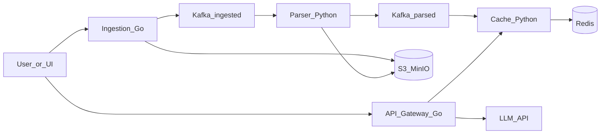
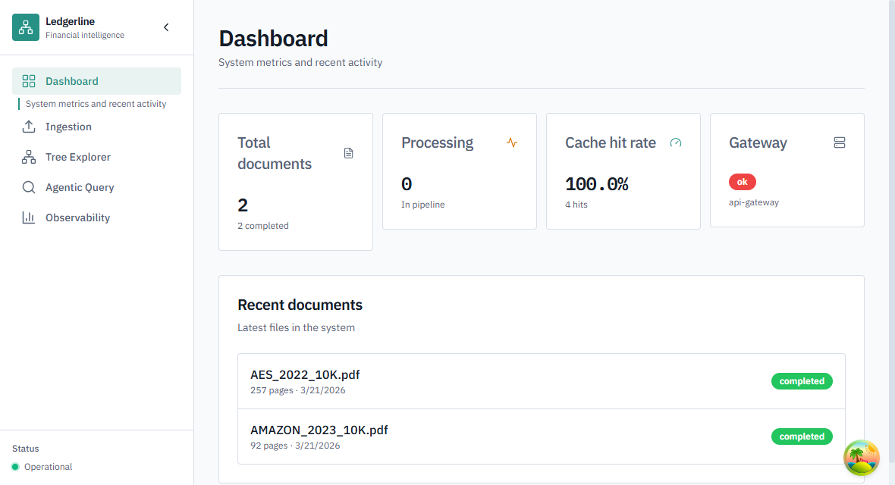
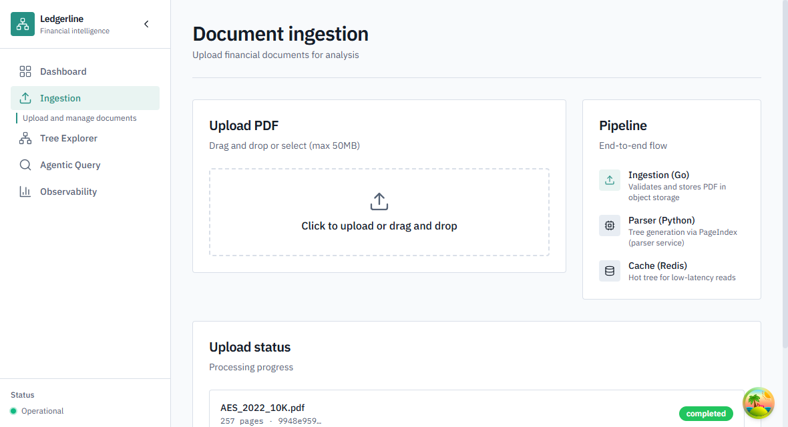
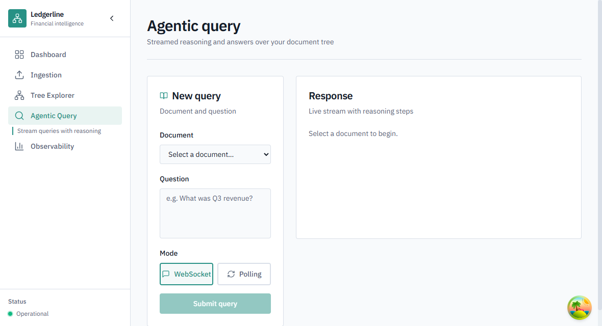
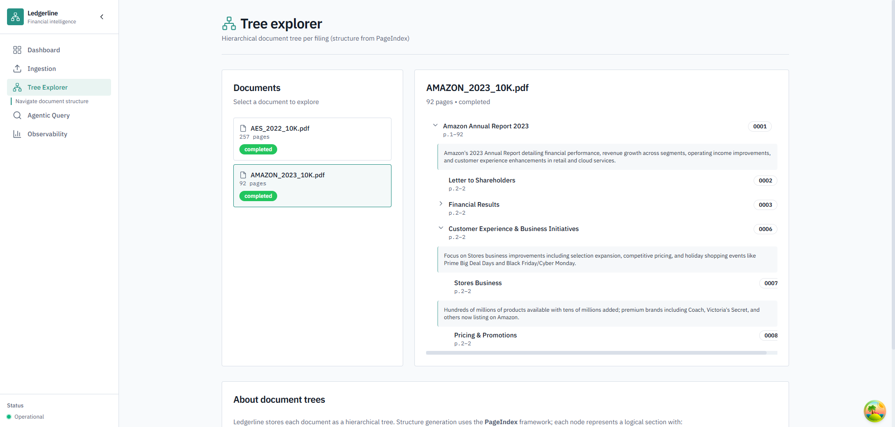

# Ledgerline

Ledgerline is a **vectorless RAG** demo stack for financial PDFs: documents are ingested, parsed into a **hierarchical tree** ([PageIndex](https://github.com/VectifyAI/PageIndex)), cached in Redis, and queried through an API gateway that uses an LLM to navigate the tree and answer questions. There is no vector database and no fixed chunking step in the retrieval path.




---

## Prerequisites


| Requirement     | Notes                                                   |
| --------------- | ------------------------------------------------------- |
| Docker Desktop  | Compose v2; used for Kafka, Redis, MinIO, Postgres, UIs |
| Go 1.21+        | Ingestion + API gateway                                 |
| Python 3.11+    | Parser, cache, evaluation                               |
| Node.js 18+     | Optional `web/` dashboard                               |
| LLM credentials | Set at least one provider in `.env` (see below)         |


---

## Environment

1. Copy the template and edit values:
  ```bash
   cp .env.example .env
  ```
2. **S3 bucket names (local)** must match what Docker creates. In [docker/docker-compose.yml](docker/docker-compose.yml) the MinIO init job creates `pageindex-documents-dev` and `pageindex-trees-dev`. `[.env.example](.env.example)` is aligned with those names; if you change either side, keep them in sync or uploads will fail with `NoSuchBucket`.
3. **LLM keys** (see `.env.example` for full list):
  - **Recommended for this repo:** set `CLAUDE_API_KEY` and `CLAUDE_MODEL` for Anthropic.
  - Alternatives documented in `.env.example`: Gemini (`GEMINI_API_KEY`), OpenAI-compatible endpoints, etc.
4. **Gateway** loads `.env` from the repo root or service directory. **Parser and cache** load the repo root `.env` automatically when you start them from `services/`*.

---

## Start infrastructure

From the repository root:

```bash
make up
```

Or:

```bash
docker compose -f docker/docker-compose.yml up -d
```

Typical local URLs:


| Service                 | URL / host                                                                                |
| ----------------------- | ----------------------------------------------------------------------------------------- |
| Kafka UI                | [http://localhost:8090](http://localhost:8090)                                            |
| MinIO API               | [http://localhost:9000](http://localhost:9000) (user `minioadmin`, password `minioadmin`) |
| MinIO console           | [http://localhost:9001](http://localhost:9001)                                            |
| Redis                   | `localhost:6379`                                                                          |
| PostgreSQL (evaluation) | `localhost:5433` (see compose; DB `pageindex_eval`, user `pageindex`)                     |


Stop containers (keep volumes): `make down`. Nuke data: `make clean`.

---

## Start application services

### Windows (recommended)

From the repo root (PowerShell):

```powershell
.\scripts\dev\start-local.ps1
```

- Add `-WithWeb` to also start the Next.js app on port 3000.
- Add `-SkipHealthWait` to skip the post-start health poll.

Stop app processes on ports 8080–8083: `.\scripts\dev\stop-local.ps1`. Add `-IncludeWeb` to also stop whatever is listening on port 3000. Docker stack is **not** stopped; use `make down` for infra.

### macOS / Linux

Use four terminals from the repo root (after `make up` and Python deps installed):

```bash
make run-ingestion
make run-parser
make run-cache
make run-gateway
```

Optional evaluation consumer:

```bash
make run-evaluation
```

---

## Web dashboard

```bash
cd web
npm ci
npm run dev
```

Open [http://localhost:3000](http://localhost:3000). The UI expects the API gateway (and the rest of the stack) to be running.

### Screenshots

Representative views from the Next.js UI (sidebar navigation is the same across pages).

| | |
| --- | --- |
| **Dashboard** — documents, cache hit rate, gateway health, recent filings | **Ingestion** — PDF upload, pipeline (ingestion → parser → cache), upload status |
|  |  |
| **Agentic query** — pick a document, ask in natural language, stream reasoning and answers | **Tree explorer** — browse filings and inspect the PageIndex hierarchy |
|  |  |

---

## Smoke test

1. Confirm health:
  ```bash
   curl -s http://localhost:8080/health
   curl -s http://localhost:8081/health
   curl -s http://localhost:8082/health
   curl -s http://localhost:8083/health
  ```
2. Upload a PDF:
  ```bash
   curl -s -F "file=@path/to/file.pdf" http://localhost:8080/documents/upload
  ```
   Save `doc_id` from the JSON response.
3. Wait for parsing (depends on PDF size and LLM latency), then query:
  ```bash
   curl -s -X POST http://localhost:8083/query \
     -H "Content-Type: application/json" \
     -d "{\"doc_id\":\"YOUR_DOC_ID\",\"question\":\"What is the main topic?\"}"
  ```
4. WebSocket streaming (requires a WS client such as `wscat`): connect to `ws://localhost:8083/ws` and send JSON `{"doc_id":"...","question":"..."}`.

---

## Sample PDFs and seeding (optional)

With the stack running, you can generate tiny local PDFs and upload them:

```bash
# From repo root (installs reportlab if needed)
python scripts/seed/create-test-pdf.py
```

Then ingest everything under `sample-data/` (create the folder locally; it is gitignored):

```powershell
.\scripts\seed\ingest-documents.ps1
```

Or run the full fetch → ingest → verify flow:

```powershell
.\scripts\seed\run-seeding.ps1
```

The fetch step runs `create-test-pdf.py` (not a remote dataset). You can also place your own PDFs in `sample-data/` and run `ingest-documents.ps1` alone.

---

## API specification

Machine-readable contract: [docs/api-spec.yaml](docs/api-spec.yaml).

---

## Smoke test (manual)

With infra and all four core services running, after a document is parsed and cached, query the gateway (replace `DOC_ID`):

```bash
curl -s -X POST http://localhost:8083/query -H "Content-Type: application/json" -d "{\"doc_id\":\"DOC_ID\",\"question\":\"What is this document about?\"}"
```

---

## Deployment (AWS / Kubernetes)

High-level checklist:

1. **Infrastructure:** Terraform under [infrastructure/terraform/](infrastructure/terraform/) (VPC, EKS, MSK, ElastiCache, S3, IAM, etc. - see variables and modules there).
2. **Manifests:** [kubernetes/](kubernetes/) base + overlays; adjust images and secrets for your registry.
3. **Cluster access:** `kubectl` configured for the target cluster; apply overlays (e.g. `make deploy-dev` / `make deploy-prod` if your Makefile targets match your environment).

Details vary by account and region; treat the above as pointers, not a full runbook.

---

## Troubleshooting


| Symptom                           | Things to check                                                                                   |
| --------------------------------- | ------------------------------------------------------------------------------------------------- |
| `NoSuchBucket` on upload          | `S3_BUCKET_`* in `.env` vs MinIO bucket names in `docker/docker-compose.yml`                      |
| Empty or nonsense answers         | Missing LLM API key in `.env`; gateway may fall back to mock behavior                             |
| Cache hit rate stays zero         | Parser must consume `documents.parsed` and cache must warm; repeat reads after a successful parse |
| Browser cannot call cache service | Prefer the gateway for browser-facing APIs (CORS)                                                 |
| Evaluation metrics stuck at zero  | Postgres URL/credentials must match the running DB; topic `queries.completed` and sampling rate   |


---

## Contributing

Issues and PRs welcome. Run `make test` and relevant integration checks before submitting. Keep secrets out of git (`.env` is ignored).